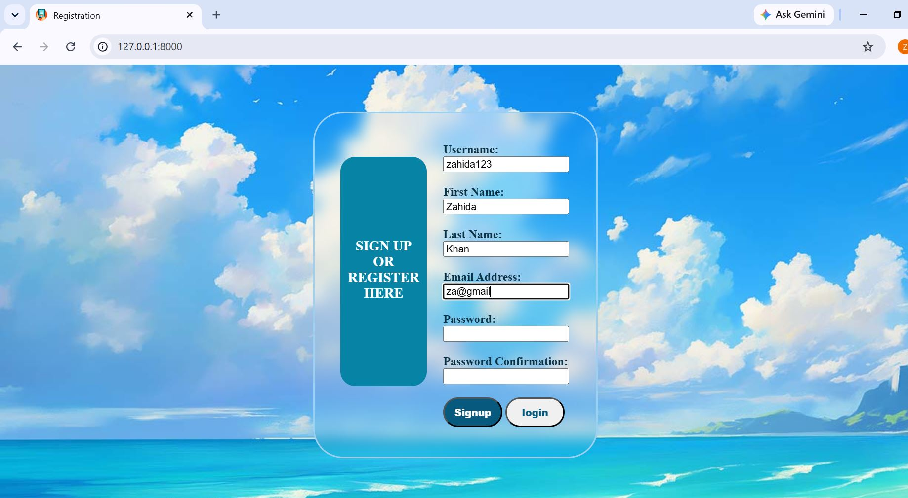
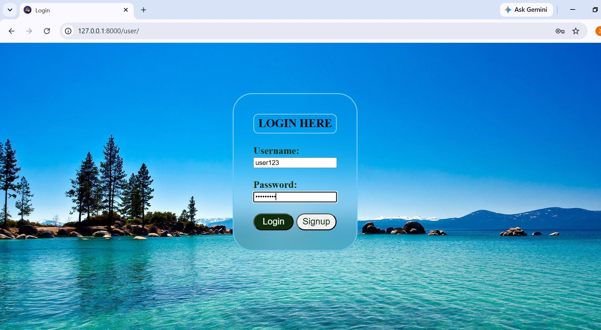
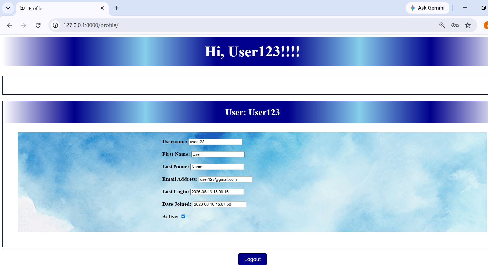

# User Authentication System

A Django-based User Authentication System developed using Python, Django, HTML, CSS, and SQLite. The application allows users to register, log in securely, manage their profiles, and enables administrators to manage user information through the Django admin panel.

## Project Overview

This project demonstrates the implementation of a complete authentication system using Django. Users can create accounts, log in with their credentials, access their profile information, and securely log out. Administrators can manage all registered users through the Django Admin Dashboard.

The project showcases Django's authentication framework, user management, database integration, and template rendering capabilities.

## Features

- User Registration (Sign Up)
- User Login
- User Logout
- User Profile Page
- Secure Authentication using Django
- Django Admin Dashboard
- User Data Management
- SQLite Database Integration
- Session Management

## Technologies Used

- Python
- Django
- SQLite
- HTML
- CSS

## Screenshots

### Home / Sign Up Page


### Login Page


### User Profile Page


### Admin Profile Page

.JPG)

.JPG)

.JPG)

.JPG)

### Django Admin Dashboard

.JPG)

.JPG)

## How to Run the Project

### 1. Clone the Repository

```bash
git clone https://github.com/zahidacodes/user-authentication-system.git
```

### 2. Navigate to the Project Directory

```bash
cd user-authentication-system
```

### 3. Install Django

```bash
pip install django
```

### 4. Run the Development Server

```bash
python manage.py runserver
```

### 5. Open the Application

Open your browser and visit:

```text
http://127.0.0.1:8000/
```

## Database

This repository includes the `db.sqlite3` database file with sample user records for demonstration purposes.

## User Authentication Flow

### Sign Up
New users can create an account by providing the required information.

### Login
Registered users can log in securely using their credentials.

### User Profile
Authenticated users can view their profile information.

### Admin Dashboard
Administrators can manage all registered users through Django Admin.

### Logout
Users can securely end their session using the logout functionality.

## Project Structure

```text
user-authentication-system/
│
├── manage.py
├── db.sqlite3
├── templates/
├── static/
├── ProjectScreenshots/
├── app/
├── usercreateform/
└── README.md
```

## Future Improvements

- Password Reset Functionality
- Email Verification
- Profile Picture Upload
- User Role Management
- Two-Factor Authentication

## Author

Zahida
